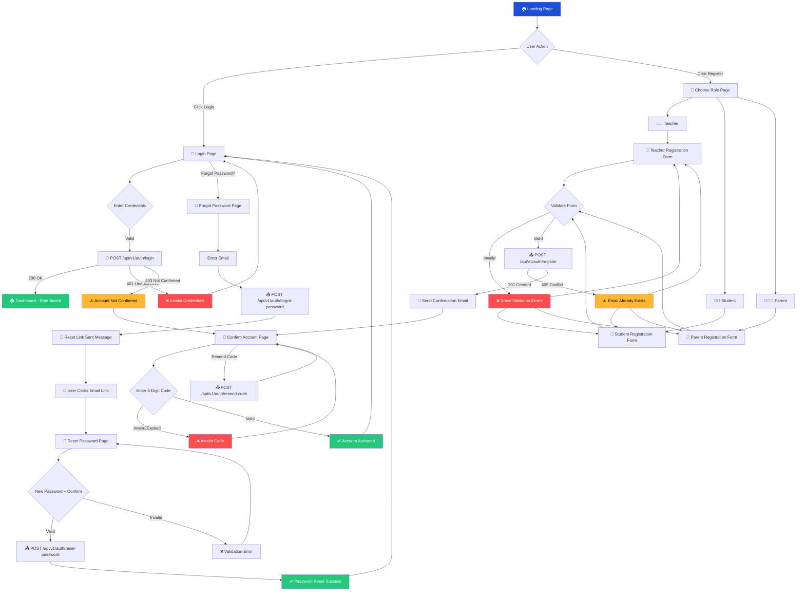

# Authentication Flow Diagram

```mermaid
flowchart TD
    A[🏠 Landing Page] --> B{User Action}
    
    B -->|Click Login| C[📧 Login Page]
    B -->|Click Register| D[👤 Choose Role Page]
    
    %% Registration Flow
    D --> E[👨‍🏫 Teacher]
    D --> F[👨‍🎓 Student]
    D --> G[👨‍👩‍👧 Parent]
    
    E --> H[📝 Teacher Registration Form]
    F --> I[📝 Student Registration Form]
    G --> J[📝 Parent Registration Form]
    
    H --> K{Validate Form}
    I --> K
    J --> K
    
    K -->|Invalid| L[❌ Show Validation Errors]
    L --> H
    L --> I
    L --> J
    
    K -->|Valid| M[📤 POST /api/v1/auth/register]
    
    M -->|409 Conflict| N[⚠️ Email Already Exists]
    N --> H
    N --> I
    N --> J
    
    M -->|201 Created| O[📧 Send Confirmation Email]
    O --> P[🔢 Confirm Account Page]
    
    P --> Q{Enter 6-Digit Code}
    Q -->|Invalid/Expired| R[❌ Invalid Code]
    R --> P
    Q -->|Valid| S[✅ Account Activated]
    S --> C
    
    P -->|Resend Code| T[📤 POST /api/v1/auth/resend-code]
    T --> P
    
    %% Login Flow
    C --> U{Enter Credentials}
    U -->|Valid| V[🔑 POST /api/v1/auth/login]
    V -->|200 OK| W[🏠 Dashboard - Role Based]
    V -->|401 Unauthorized| X[❌ Invalid Credentials]
    X --> C
    V -->|403 Not Confirmed| Y[⚠️ Account Not Confirmed]
    Y --> P
    
    %% Forgot Password Flow
    C -->|Forgot Password?| Z[📧 Forgot Password Page]
    Z --> AA[Enter Email]
    AA --> AB[📤 POST /api/v1/auth/forgot-password]
    AB --> AC[📧 Reset Link Sent Message]
    AC --> AD[📧 User Clicks Email Link]
    AD --> AE[🔑 Reset Password Page]
    AE --> AF{New Password + Confirm}
    AF -->|Valid| AG[📤 POST /api/v1/auth/reset-password]
    AG --> AH[✅ Password Reset Success]
    AH --> C
    AF -->|Invalid| AI[❌ Validation Error]
    AI --> AE
    
    style A fill:#1B4FD8,color:#fff
    style W fill:#22C97A,color:#fff
    style S fill:#22C97A,color:#fff
    style AH fill:#22C97A,color:#fff
    style L fill:#FF4D4D,color:#fff
    style X fill:#FF4D4D,color:#fff
    style R fill:#FF4D4D,color:#fff
    style N fill:#FFB830,color:#000
    style Y fill:#FFB830,color:#000
```
