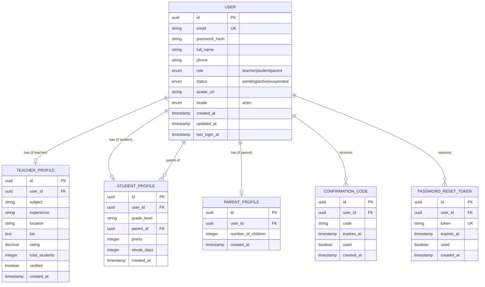
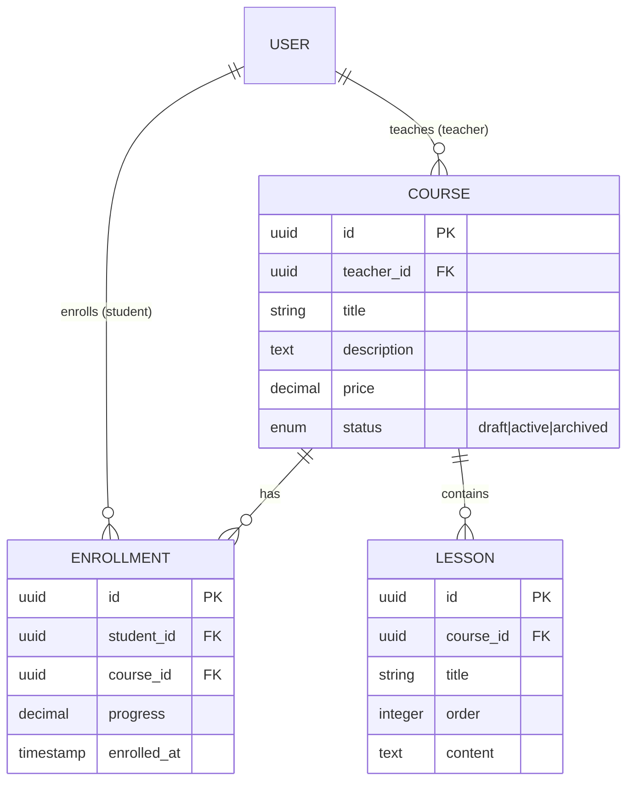

# Domain Entity Relationship Diagram

```mermaid
erDiagram
    USER {
        uuid id PK
        string email UK
        string password_hash
        string full_name
        string phone
        enum role "teacher|student|parent"
        enum status "pending|active|suspended"
        string avatar_url
        enum locale "ar|en"
        timestamp created_at
        timestamp updated_at
        timestamp last_login_at
    }

    TEACHER_PROFILE {
        uuid id PK
        uuid user_id FK
        string subject
        string experience
        string location
        text bio
        decimal rating
        integer total_students
        boolean verified
        timestamp created_at
    }

    STUDENT_PROFILE {
        uuid id PK
        uuid user_id FK
        string grade_level
        uuid parent_id FK
        integer points
        integer streak_days
        timestamp created_at
    }

    PARENT_PROFILE {
        uuid id PK
        uuid user_id FK
        integer number_of_children
        timestamp created_at
    }

    CONFIRMATION_CODE {
        uuid id PK
        uuid user_id FK
        string code
        timestamp expires_at
        boolean used
        timestamp created_at
    }

    PASSWORD_RESET_TOKEN {
        uuid id PK
        uuid user_id FK
        string token UK
        timestamp expires_at
        boolean used
        timestamp created_at
    }

    USER ||--o| TEACHER_PROFILE : "has (if teacher)"
    USER ||--o| STUDENT_PROFILE : "has (if student)"
    USER ||--o| PARENT_PROFILE : "has (if parent)"
    USER ||--o{ CONFIRMATION_CODE : "receives"
    USER ||--o{ PASSWORD_RESET_TOKEN : "requests"
    USER ||--o{ STUDENT_PROFILE : "parent of"
```

## Future Entities (Phase 2+)

```mermaid
erDiagram
    USER ||--o{ COURSE : "teaches (teacher)"
    USER ||--o{ ENROLLMENT : "enrolls (student)"
    
    COURSE {
        uuid id PK
        uuid teacher_id FK
        string title
        text description
        decimal price
        enum status "draft|active|archived"
    }

    ENROLLMENT {
        uuid id PK
        uuid student_id FK
        uuid course_id FK
        decimal progress
        timestamp enrolled_at
    }

    COURSE ||--o{ ENROLLMENT : "has"
    COURSE ||--o{ LESSON : "contains"

    LESSON {
        uuid id PK
        uuid course_id FK
        string title
        integer order
        text content
    }
```
