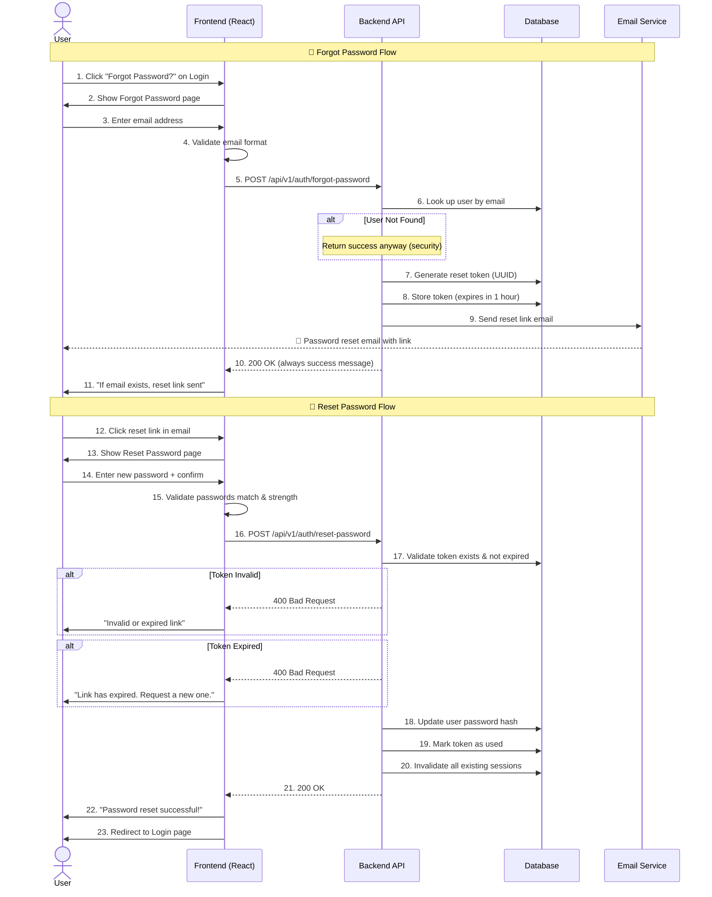
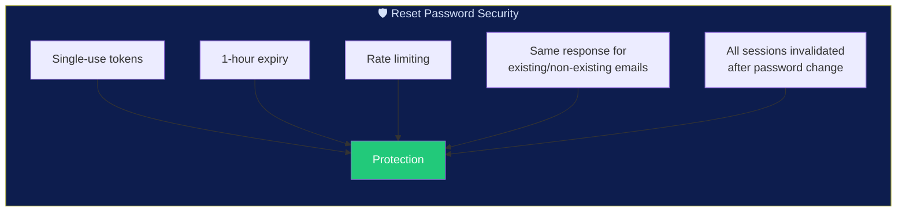

# Password Reset Flow Diagram

```mermaid
sequenceDiagram
    actor User
    participant UI as Frontend (React)
    participant API as Backend API
    participant DB as Database
    participant Email as Email Service

    Note over User, Email: 🔑 Forgot Password Flow

    User->>UI: 1. Click "Forgot Password?" on Login
    UI->>User: 2. Show Forgot Password page
    
    User->>UI: 3. Enter email address
    UI->>UI: 4. Validate email format
    UI->>API: 5. POST /api/v1/auth/forgot-password

    API->>DB: 6. Look up user by email
    
    alt User Not Found
        Note over API: Return success anyway (security)
    end

    API->>DB: 7. Generate reset token (UUID)
    API->>DB: 8. Store token (expires in 1 hour)
    API->>Email: 9. Send reset link email
    Email-->>User: 📧 Password reset email with link

    API-->>UI: 10. 200 OK (always success message)
    UI->>User: 11. "If email exists, reset link sent"

    Note over User, Email: 🔐 Reset Password Flow

    User->>UI: 12. Click reset link in email
    UI->>User: 13. Show Reset Password page
    
    User->>UI: 14. Enter new password + confirm
    UI->>UI: 15. Validate passwords match & strength
    UI->>API: 16. POST /api/v1/auth/reset-password

    API->>DB: 17. Validate token exists & not expired
    
    alt Token Invalid
        API-->>UI: 400 Bad Request
        UI->>User: "Invalid or expired link"
    end

    alt Token Expired
        API-->>UI: 400 Bad Request
        UI->>User: "Link has expired. Request a new one."
    end

    API->>DB: 18. Update user password hash
    API->>DB: 19. Mark token as used
    API->>DB: 20. Invalidate all existing sessions

    API-->>UI: 21. 200 OK
    UI->>User: 22. "Password reset successful!"
    UI->>User: 23. Redirect to Login page
```

## Security Measures

```mermaid
flowchart LR
    subgraph Security["🛡️ Reset Password Security"]
        A[Single-use tokens] --> E[Protection]
        B[1-hour expiry] --> E
        C[Rate limiting] --> E
        D[Same response for<br/>existing/non-existing emails] --> E
        F[All sessions invalidated<br/>after password change] --> E
    end

    style Security fill:#0D1D4E,color:#D6E3FA
    style E fill:#22C97A,color:#fff
```
