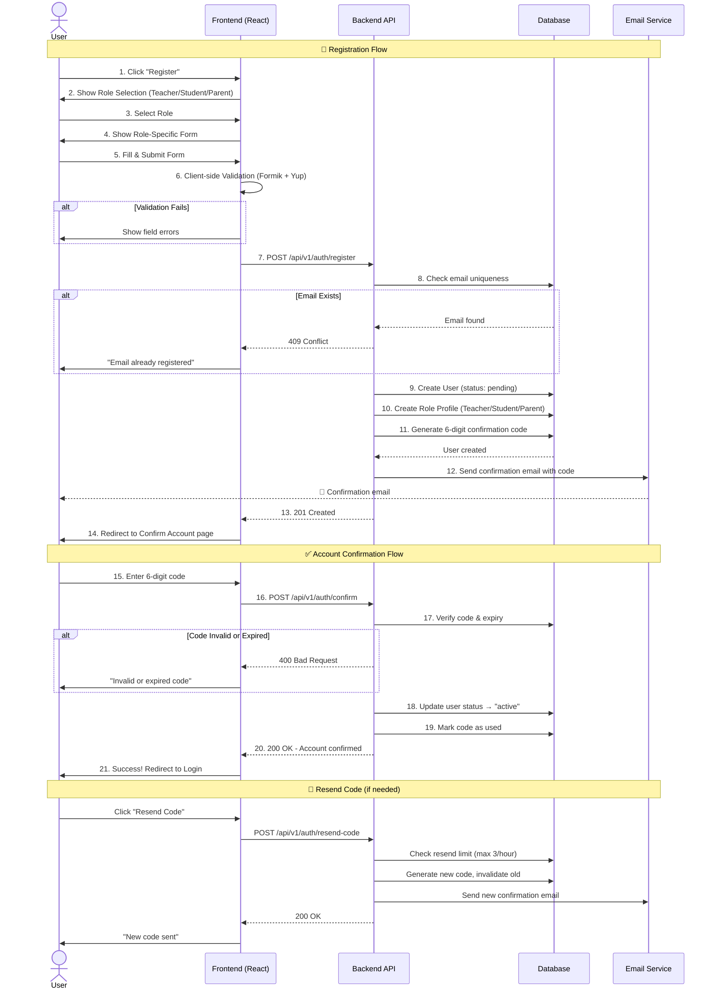

# Registration Sequence Diagram

```mermaid
sequenceDiagram
    actor User
    participant UI as Frontend (React)
    participant API as Backend API
    participant DB as Database
    participant Email as Email Service

    Note over User, Email: 📝 Registration Flow

    User->>UI: 1. Click "Register"
    UI->>User: 2. Show Role Selection (Teacher/Student/Parent)
    User->>UI: 3. Select Role
    UI->>User: 4. Show Role-Specific Form

    User->>UI: 5. Fill & Submit Form
    UI->>UI: 6. Client-side Validation (Formik + Yup)
    
    alt Validation Fails
        UI->>User: Show field errors
    end

    UI->>API: 7. POST /api/v1/auth/register
    
    API->>DB: 8. Check email uniqueness
    
    alt Email Exists
        DB-->>API: Email found
        API-->>UI: 409 Conflict
        UI->>User: "Email already registered"
    end

    API->>DB: 9. Create User (status: pending)
    API->>DB: 10. Create Role Profile (Teacher/Student/Parent)
    API->>DB: 11. Generate 6-digit confirmation code
    
    DB-->>API: User created
    API->>Email: 12. Send confirmation email with code
    Email-->>User: 📧 Confirmation email
    
    API-->>UI: 13. 201 Created
    UI->>User: 14. Redirect to Confirm Account page

    Note over User, Email: ✅ Account Confirmation Flow

    User->>UI: 15. Enter 6-digit code
    UI->>API: 16. POST /api/v1/auth/confirm
    
    API->>DB: 17. Verify code & expiry
    
    alt Code Invalid or Expired
        API-->>UI: 400 Bad Request
        UI->>User: "Invalid or expired code"
    end

    API->>DB: 18. Update user status → "active"
    API->>DB: 19. Mark code as used
    
    API-->>UI: 20. 200 OK - Account confirmed
    UI->>User: 21. Success! Redirect to Login

    Note over User, Email: 🔄 Resend Code (if needed)

    User->>UI: Click "Resend Code"
    UI->>API: POST /api/v1/auth/resend-code
    API->>DB: Check resend limit (max 3/hour)
    API->>DB: Generate new code, invalidate old
    API->>Email: Send new confirmation email
    API-->>UI: 200 OK
    UI->>User: "New code sent"
```
