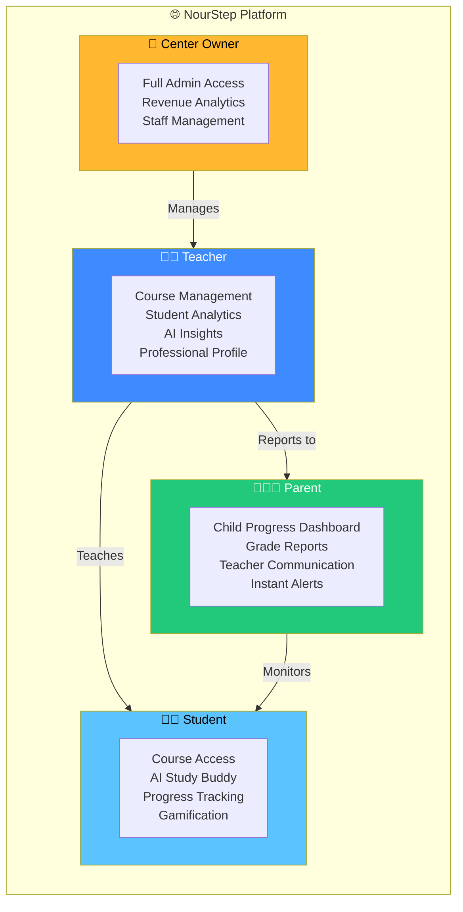
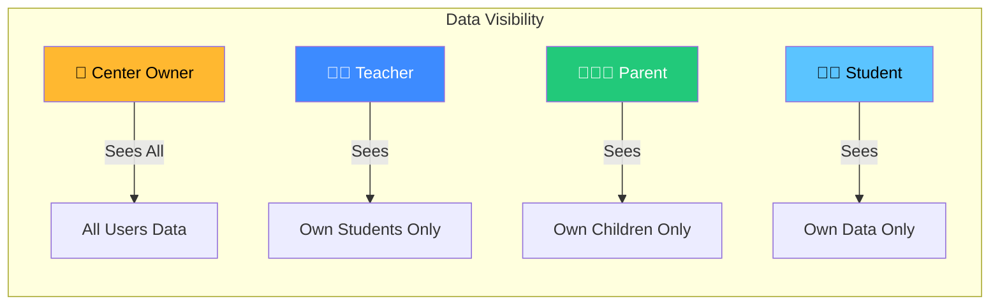

# User Roles Hierarchy

```mermaid
graph TB
    subgraph Platform["🌐 NourStep Platform"]
        direction TB
        
        subgraph CO["🏢 Center Owner"]
            CO_DESC["Full Admin Access<br/>Revenue Analytics<br/>Staff Management"]
        end
        
        subgraph T["👨‍🏫 Teacher"]
            T_DESC["Course Management<br/>Student Analytics<br/>AI Insights<br/>Professional Profile"]
        end
        
        subgraph P["👨‍👩‍👧 Parent"]
            P_DESC["Child Progress Dashboard<br/>Grade Reports<br/>Teacher Communication<br/>Instant Alerts"]
        end
        
        subgraph S["👨‍🎓 Student"]
            S_DESC["Course Access<br/>AI Study Buddy<br/>Progress Tracking<br/>Gamification"]
        end
    end
    
    CO -->|Manages| T
    T -->|Teaches| S
    P -->|Monitors| S
    T -->|Reports to| P
    
    style CO fill:#FFB830,color:#000
    style T fill:#3D8BFF,color:#fff
    style P fill:#22C97A,color:#fff
    style S fill:#5BC4FF,color:#000
```

## Data Access Scope

```mermaid
graph LR
    subgraph Access["Data Visibility"]
        CO2["🏢 Center Owner"] -->|Sees All| ALL["All Users Data"]
        T2["👨‍🏫 Teacher"] -->|Sees| OWN_STUDENTS["Own Students Only"]
        P2["👨‍👩‍👧 Parent"] -->|Sees| OWN_CHILDREN["Own Children Only"]
        S2["👨‍🎓 Student"] -->|Sees| OWN_DATA["Own Data Only"]
    end
    
    style CO2 fill:#FFB830,color:#000
    style T2 fill:#3D8BFF,color:#fff
    style P2 fill:#22C97A,color:#fff
    style S2 fill:#5BC4FF,color:#000
```
